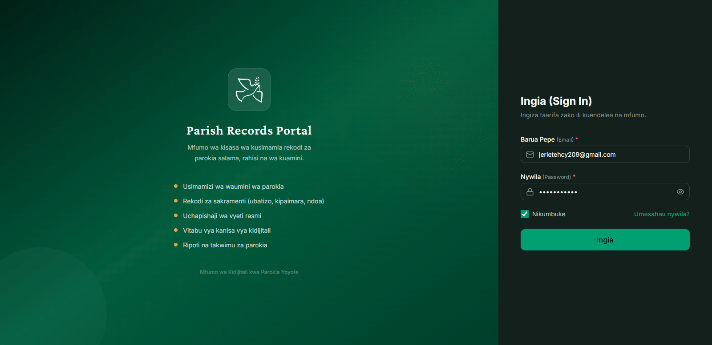

<h1 align="center"><strong>🕊️ Parish Records Portal (PRP)</strong></h1>

## Development Specification

**Version:** 1.0

**Status:** Approved

**Project Name:** Parish Records Portal

**Abbreviation:** PRP

---

# 1. Project Overview

Parish Records Portal (PRP) is a modern web-based Catholic Parish Records Management System designed specifically for Parish Secretariat Offices.

The system shall securely manage, organize, search, update, and maintain parishioners' information, sacramental records, church certificates, official parish registers, and parish administrative operations.

PRP shall provide a professional, clean, secure, responsive, and modern user experience while preserving Catholic administrative workflows and sacramental record standards.

The system language shall primarily be Swahili, with English helper descriptions where necessary to improve administrator understanding.

---

# 2. Project Goal

The objective is to digitize parish record management by replacing paper-based workflows with a centralized secure web application.

The system must simplify:

- Parishioner Registration
- Baptism Records
- Confirmation Records
- First Communion Records
- Marriage Records
- Church Registers
- Certificate Management
- Member Searching
- Reporting
- Secure Administration

---

# 3. Target Users

Primary User:

Parish Secretary (Administrator)

Future Expansion:

- Parish Priest
- Assistant Secretary
- Diocese Administrator
- Super Administrator

Version 1 shall focus ONLY on Parish Secretary.

---

# 4. System Type

Modern Administrative Dashboard

NOT

Public Church Website

This system is an internal administrative platform.

---

# 5. Primary Modules

Dashboard

Authentication

Parishioners

Sacraments

Certificates

Church Registers

Reports

Search

Notifications

Audit Logs

Settings

User Profile

---

# 6. Technology Stack

| tech feature | tech stack |
|--------------|------------|
| Frontend     |    |
| Backend      |     |
| Database     |  |
| ORM          |      |
| Authentication    |  |
| Styling      | |
| Icons        |   |
| PDF          |  |
| Charts       |  |
| Forms        |  |
| Validation   |    |
| Tables       |  |
| Notifications |  |
| Animations |   |
| Uploads |   |

---

# 7. Design Philosophy

The application shall appear

Professional

Modern

Minimal

Clean

Trustworthy

Elegant

Calm

The interface shall never appear crowded.

Whitespace shall be used generously.

Every screen shall feel simple to use.

---

# 8. Branding

System Name

Parish Records Portal

Abbreviation

PRP

Use provided PRP logo throughout the application.

The logo shall appear

Splash Screen

Authentication Pages

Sidebar Header

Browser Favicon

Loading Screen

---

# 9. Language

Primary Language

Swahili

Secondary Language

English helper text

Example

Jina Kamili

(Full Name)

Namba ya Ubatizo

(Baptism Number)

Cheti

(Certificate)

The entire system shall remain Swahili-first.

---

# 10. Authentication

Secure Login

Forgot Password

Reset Password

Session Timeout

Logout

Remember Me

Secure Password Hashing

Role Ready

Future Multi-user Support

---

# 11. Security Principles

Never trust frontend validation.

Validate everything on backend.

Prevent

SQL Injection

XSS

CSRF

Broken Authentication

Broken Access Control

Sensitive Data Exposure

Use

Parameterized Queries

HTTP Only Cookies

JWT

Input Validation

Password Hashing

Environment Variables

Secure Upload Validation

Audit Logging

---

# 12. Performance

Fast Loading

Lazy Loading

Pagination

Server Side Filtering

Server Side Searching

Image Optimization

Code Splitting

Responsive Rendering

---

# 13. Responsive Behaviour

Desktop

Laptop

Tablet

Mobile

Every page shall remain fully usable.

No horizontal scrolling.

---

# 14. Accessibility

Keyboard Navigation

Proper Labels

Accessible Forms

Proper Contrast

Visible Focus States

Semantic HTML

---

# 15. Catholic Domain Standards

The system shall preserve official Catholic parish administrative workflows.

Supported Sacraments

Baptism

Confirmation

First Holy Communion

Marriage

RCIA

Future Ready

Holy Orders

Death Register

Each parishioner shall maintain a lifelong sacramental history.

---

# 16. Parishioner Information

Each parishioner profile may contain

Christian Name

Full Name

Gender

Photo

Date of Birth

Place of Birth

Phone

Email

Occupation

Address

Parents

Father

Mother

Religion of Parents

National ID (Optional)

Family Number

Jumuiya

Kigango

Parish

Diocese

Registration Number

Status

---

# 17. Certificate Management

Supported Certificates

Baptism Certificate

Confirmation Certificate

First Communion Certificate

Marriage Certificate

Certificate Preview

Certificate Upload

Certificate Download

Certificate Printing

PDF Storage

Scanned Images

---

# 18. Church Registers

Baptism Register

Marriage Register

Confirmation Register

Communion Register

Every record shall preserve

Book Number

Page Number

Entry Number

Official Numbering

---

# 19. User Experience

Administrator shall accomplish every major task within minimal clicks.

Searching shall be instant.

Filtering shall be simple.

Forms shall be clearly grouped.

Buttons shall always remain visible.

Confirmation dialogs shall prevent accidental deletion.

---

# 20. Coding Standards

Clean Architecture

Reusable Components

Reusable Hooks

Modular APIs

Meaningful Variable Names

Comment Important Logic

Avoid Duplicate Code

Consistent Naming

Readable Folder Structure

---

# 21. Documentation Standards

Every implemented module shall include

Updated documentation

API explanation

Database explanation

Developer comments

Meaningful commit messages

---

# 22. Deliverable

Version 1.0 establishes the official engineering foundation for Parish Records Portal.

Every future implementation shall strictly follow this specification.
